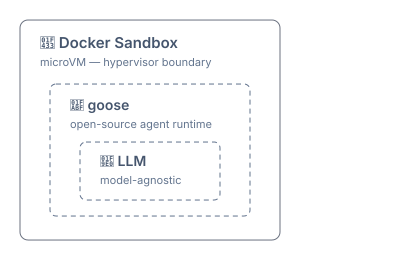

# 🪿 autonomous-agents-setup

Working notes on running Claude Code agents autonomously with real isolation boundaries — sandboxes, git identity separation, and session management. 

#### Agent Stack



## Design Goals

### Security

- Hardware-level isolation — hypervisor boundary, not config rules.
- Agent has own identity
  - separate cryptographically signed commits
  - can piggy-back on auth to LLM subscriptions, e.g. Claude
  - but has own credentials to SDLC services, e.g. git, deployments, etc.

### Orchestration

- Visibility into a stuck or crashed agent that doesn't depend on it reaching GitHub.

### Sub-agents (fit-for-purpose)

- Run _autonomously_ outside the IDE, in parallel, without them colliding.
- Task specific agents, e.g. `frontend-dev` vs `backend-dev`, vs `qa-checker`
- Size-for-purpose, e.g. use cheaper models, which work fine in decomposed tasks.

## Existing Setup (July 2026)

- Dev containers ([Isolation Level 1](./architecture/README.md)) in Zed.

### Dev Container

#### Pros

- Agent cannot `cd ./..` into parent folder
- Memory is still persisted across sessions
- My personal credential files e.g. `~/.ssh`, `~/.aws/credentials` are not accessible.

#### Cons

- Shared host kernel (nice to have)
- Secure, but slow: because I am security conscious, I rarely give Claude broad permissions and have to manually click "Allow once" for _every_ change. 
- Claude owns/drives subagents
  - No _per-task_ model selection. By default subagents inherit main session's model, e.g. Opus – not cost effective. The `CLAUDE_CODE_SUBAGENT_MODEL` env var is not task configurable.  
  - No visibility into subagents – need to wait until it finishes just to realize it hallucinated and did the wrong thing. I want to be able to live inspect and course-correct.

#### Setup

To persist Claude's memory over multiple session via mounts:

- **Persisted Memory** — `~/.claude`, keyed by workspace path slug, e.g. 
- **Workspace Folder** — Yes, mirroring the exact host path so the slug matches.

The host path `/Users/jng/workspace/julie-ng/tally-split-ai` is hard-coded into the config:

```json
/* Example .devcontainer.json */
{
  "name": "Claude Node Sandbox",
  "image": "mcr.microsoft.com/devcontainers/javascript-node:22",
  "workspaceMount": "source=${localWorkspaceFolder},target=/Users/jng/workspace/julie-ng/tally-split-ai,type=bind,consistency=cached",
  "workspaceFolder": "/Users/jng/workspace/julie-ng/tally-split-ai",
  "mounts": [
    "source=${localEnv:HOME}/.claude,target=/home/node/.claude,type=bind",
    "target=${containerWorkspaceFolder}/node_modules,type=volume"
  ],
  "onCreateCommand": "sudo chown -R node:node ${containerWorkspaceFolder}/node_modules",
  "postCreateCommand": "npm install && npm install -g @anthropic-ai/claude-code",
  "customizations": {
    "zed": {
      "extensions": ["eslint", "html", "sql", "vue", "mcp-server-context7"]
    }
  }
}
```

Claude config `~/.claude.json` is intentionally **not mounted** because concurrent writes corrupts the file. Trade-offs:

- folders need re-trusting every time
- need in-repo `.mcp.json`

## Current Progress

Loose wording now to capture what's needed.

### Agent Setup

- [X] Installed official Docker sandbox image for claude-code with `/login` to my subscription
- [X] Install and test goose
- [X] Connect my Claude subscription via ACP
- [ ] Run goose from Docker Sandbox

### Orchestration

- [ ] Connect sandboxed goose with `agent-manager`
  - [ ] Wire it to the sandbox — point a pane at `sbx exec`/`ssh`, not a bare process
  - [ ] Does hook-based status survive the ACP bridge, or silently degrade to screen-inference?
  - [ ] Worktree collision — agent-manager spawns worktrees, so does `sbx`
- [ ] Connect agent-manager and Zed/claude-code as orchestrator to assign geese.

### Customization

- [ ] Package custom skills, MCP servers, plugins with goose agent.
- [ ] Deploy custom goose-agent as Docker image
- [ ] Integrate custom goose-agent with Docker Sandbox

## Decision Log

| Date | Decision |
|---|---|
| — | `.claude/settings.json` allow/deny rules are a deterrent, not a boundary. |
| — | Dev containers (Level 1) = default for real isolation. |
| — | Full VM reserved for actively-suspect code, not everyday use. |
| Incident | `~/.claude.json` bind-mounted into a devcontainer. Concurrent write truncated it, blocked new sessions. |
| Resolved | Never mount `~/.claude.json`. Mount `~/.claude` only, mirror the workspace path. |
| Found | Docker Sandboxes (`sbx`) — stronger than devcontainers (microVM, isolated daemon). CLI-only, no Zed integration. |
| Found | `sbx setup ssh` + agent forwarding = sandbox SSH access and commit signing without copying the key. Experimental, not verified. |
| Found | goose fronts Claude via ACP, reusing my subscription. Gap: no session resume/fork on ACP. |
| Found | herdr and agent-manager both viable. Neither is `sbx`-aware. agent-manager fits the worktree/review workflow better. |
| Rejected | Orca as session-manager / `sbx` front-end. Not sandbox-aware, owns its own worktree layer, provides no isolation. |
| Open | Container Use for true multi-session parallel isolation. |
| Open | **Next: layered spike.** Layer 1 = goose+ACP+Claude in `sbx`. Layer 2 = agent-manager on top. |

## References

- [agents.md](https://agents.md/)
- [goose](https://goose-docs.ai/) - open source AI Agent (part of [AAIF](https://github.com/aaif-goose/goose))
