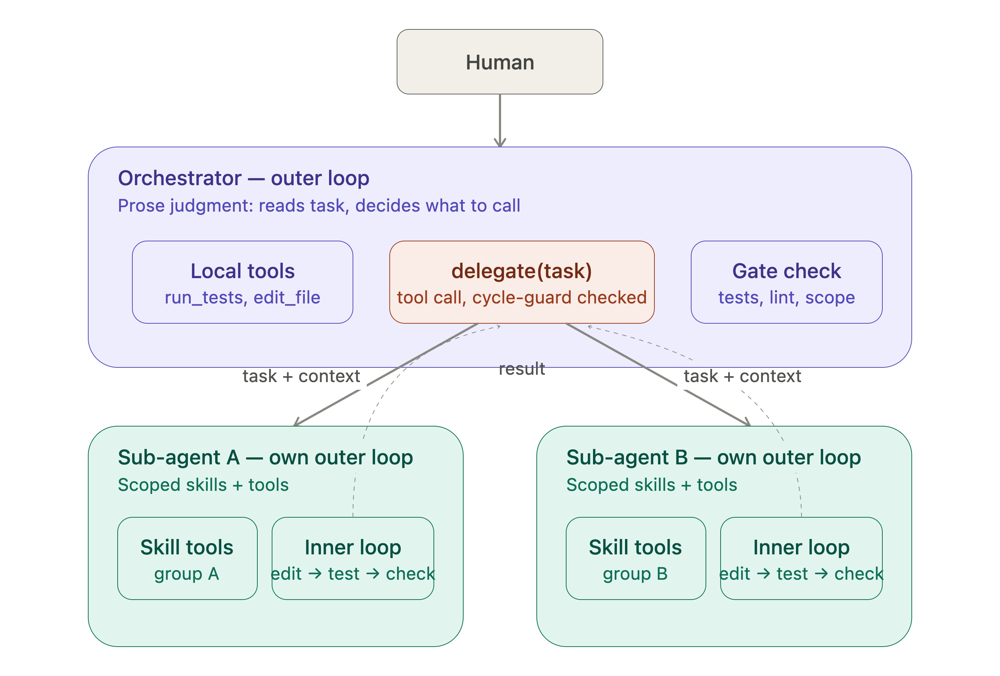
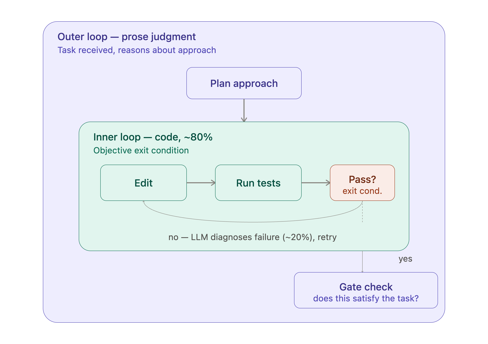
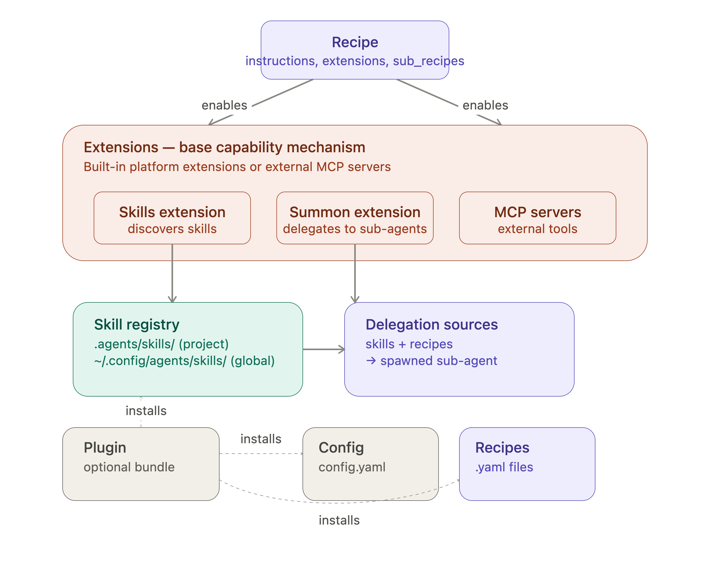

# Coding harness design — summary

This document describes a coding harness built on top of [goose](https://goose-docs.ai/) — itself a harness framework. We're building a harness, assembled *from* Goose's primitives (orchestrator + N sub-agents, code-gated inner loops, cycle guards).

## Working architecture (current state)

- Orchestrator + N sub-agents, each a standalone outer loop; orchestrator is a role by position, not a distinct type.
- Delegation as a recursive tool call, with a manually-enforced cycle guard given limited depth.
- State/context passed explicitly across delegation boundaries, never assumed shared.
- Goose as the harness framework: Skills extension for discovery, Summon extension for delegation, Recipes for config — no plugin needed for internal use.
- Web UI: deferred until Goose's ACP-over-HTTP transport stabilizes; likely path is the AI SDK community ACP provider once/if Goose compatibility is confirmed.

## Control-flow philosophy

Two approaches exist:

- **Code-driven gates:** loop and stage-boundaries are code — deterministic, enforced, debuggable.
- **Prose-driven gates:** the loop is a markdown protocol the model interprets itself (e.g. Claude Code's SKILL.md style) — flexible, but gates are advisory, not enforced.

**Decision:** use both, split by enforceability — code for anything with an objective, checkable answer (tests pass, build succeeds, budget limits); prose for genuine judgment calls (does this match intent, which sub-agent should handle this).

## Outer loop vs. inner loops

- **Outer loop** = prose/instructions-as-control-flow. Fits because transitions like "do I understand this task well enough to start" are judgment calls.
- **Inner loops** = code-driven, tight cycles with an objective exit condition (edit → test → check → repeat).
- **80/20 rule:** inner loops are ~80% code (dispatch, parse results, check exit condition, enforce iteration caps, apply edits) and ~20% LLM (the one narrow judgment call — e.g. "given this failure, what's the fix"). Keeps the LLM's role bounded and swappable rather than self-regulating the loop.

The loop-anatomy diagram shows this concretely inside a single agent: prose planning at the top, the inner edit/test/check cycle looping on failure, and a final outer-loop gate check ("does this satisfy the task?") before anything is returned — this gate resolves why the result arrow in the high-level diagram originates from the inner loop, not a separate box: the inner loop's verified output *is* what the outer loop's gate checks before handing back.

## Tools

A tool = schema + local function the loop calls in-process — no server needed by default. A server/sandbox only earns its place for isolation of untrusted code, reuse across multiple harnesses (what MCP standardizes), cross-language boundaries, or long-running stateful services.

## Delegation = recursive tool call

- Delegating to a sub-agent is a tool call (`delegate(task)`) from the outer loop's perspective — no special plumbing.
- **When to delegate** = prose judgment. **How** = code, same dispatch mechanism as any other tool.
- Sub-agents are full outer loops themselves and can delegate further — recursive, not hierarchical-by-type. "Orchestrator" is a role by position (whichever agent talks to the human), not a distinct architecture.
- **Cycle guard / max depth:** a hard code check, not prose — a safety invariant, not a judgment call. The call chain is passed as structured data; code blocks execution if depth/cycle limits are exceeded; the LLM only sees the allowed/blocked outcome. Given limited depth in this use case, this is being implemented manually rather than relying on framework support.
- Whether a sub-agent's result gets gated (tests/lint/scope-check) before being trusted is a deliberate design decision, not left to model judgment.

The high-level architecture diagram shows this end to end: the human talks to the orchestrator's outer loop, which holds local tools plus a `delegate(task)` tool (cycle-guard checked) and a gate check; delegation arrows carry task + context down to two sub-agents, each running its own outer loop with scoped skill tools and an inner loop; dashed result arrows return the verified output back up to the delegate call.

## Applying this to Goose

Goose has native subagent support via the **Summon** extension, which loads knowledge into goose's context and delegates tasks to subagents, pulling from both skills and recipes as sources.

The Goose config-structure diagram lays out how the pieces fit:

- **Recipe** — the top-level config: instructions/prompt, which extensions are enabled, parameters, model settings, and `sub_recipes` for delegation. This is the AGENTS.md-equivalent plus wiring.
- **Extensions** — the base capability mechanism (built-in platform extensions or external MCP servers). Two matter here: the **Skills extension**, which discovers skills from a registry (`.agents/skills/` project-level, `~/.config/agents/skills/` global); and the **Summon extension**, which delegates to sub-agents using skills + recipes as sources.
- **Skill registry** — where the many existing skills actually live and get discovered from; not something recipes configure directly.
- **Plugins** — optional, a packaging/distribution format only. A plugin installs into three separate places at once (skill registry, recipes, config) — it does not route through any one of them. **Decision: not needed** for internal reorg of existing skills; only relevant if distributing the setup as one installable bundle across a team.

**Gap carried over from framework:** Goose's `max_turns` caps a single sub-agent's own run, not cross-tree call-chain depth — the cycle guard remains a manual responsibility.

**State in Goose:** state ≈ the raw conversation transcript, auto-compacted near token limits — not a structured/queryable state object like LangGraph's typed, checkpointed schema. Practical implication: no shared state store between delegated agents; anything a sub-agent needs must be passed explicitly in its task/context, same as the cycle-guard chain. Worth validating later whether auto-compaction could silently drop details a gate depends on (a documented pain point across coding agents generally, not unique to Goose).

## Independent web UI on top of Goose

**`goose web` was removed:** [PR #7696](https://github.com/aaif-goose/goose/pull/7696) ("delete goose web"), by DOsinga, merged March 7, 2026 by michaelneale (commit a7fb7e1). The PR description was minimal ("What it says on the label"); a reviewer (blackgirlbytes) flagged that her team used it heavily and questioned whether usage was checked, and a later commenter (atline, April 2026) asked for the rationale — never answered in the thread. **Note:** the PR itself never states a reason; the ACP-consolidation explanation below is an inference connecting it to the broader roadmap, not an official justification.

**Why it's a reasonable inference:** Goose is standardizing on ACP (Agent Client Protocol) as the primary interface for all clients, with a roadmap explicitly aiming to eventually remove goosed and goose-cli, leaving ACP as the single interface, and an HTTP/websocket transport in progress ([issue #6642](https://github.com/aaif-goose/goose/issues/6642), [discussion #7309](https://github.com/aaif-goose/goose/discussions/7309), [discussion #4645](https://github.com/aaif-goose/goose/discussions/4645)). Framed as separating the agent runtime from the interface so goose doesn't care whether it's talked to from a terminal, a Slack bot, an IDE plugin, or a custom web dashboard — meaning a bespoke web UI is a supported future path, not a foreclosed one, once the transport stabilizes.

**Path to a custom web UI:** the community package [`@mcpc-tech/acp-ai-provider`](https://ai-sdk.dev/providers/community-providers/acp) bridges ACP agents to the Vercel AI SDK's `LanguageModel` interface, enabling building web applications and Node.js services with ACP agents, with automatic process spawning/lifecycle management. This would let a web UI call `generateText`/`streamText` against an ACP agent rather than hand-rolling ACP JSON-RPC. Caveats:

- Tools route through MCP servers in session config, not the SDK's native `tools` param
- Each model instance spawns its own process (lifecycle cleanup is your responsibility, notably for a multi-agent setup)
- Model selection isn't yet configurable
- Goose isn't currently listed among its example agent commands (Gemini CLI, Claude Code, Codex CLI are), so Goose compatibility specifically is unverified

## Other frameworks considered (context, not chosen)

- **LangGraph** — explicit graph with typed, checkpointed state; best for branching/retries/human-approval gates; more setup overhead.
- **CrewAI** — role-based, built-in hierarchical mode (manager delegates to workers) matches the orchestrator+N shape; fastest to prototype, reliability concerns reported at scale.
- **OpenAI Agents SDK** — explicit "handoff" abstraction between agents, closer to the delegation-as-tool-call model here.
- **MCP / A2A protocols** — relevant if agents need to be swappable across frameworks later.
