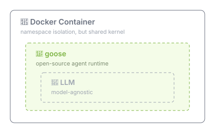

# goose — the agent front-end

[goose](https://block.github.io/goose/) is the agent runtime inside the sandbox. Claude Code is the model behind it, reached over ACP.



Why goose rather than Claude Code directly:

- Model-agnostic. Swapping to API-token providers later doesn't change the front-end.
- Prepackages plugins, skills, extensions per agent.
- Runs headless outside an IDE — the point of the whole setup.

> [!IMPORTANT]
> I chose goose because it's an [Agentic AI Foundation (AAIF)](https://aaif.io/projects/goose) project — foundation-governed with same reasoning as picking CNCF over proprietary tools: no vendor lock-in.

## The chain
 
```
goose (client) → ACP → claude-agent-acp → Claude Code
```

`claude-agent-acp` is an ACP adapter built on the official Claude Agent SDK. A client wrapper, not a replacement.

ACP providers are goose's **recommended replacement for the deprecated CLI providers**. They reuse an existing Claude Code login rather than a separate API key.

See [identity.md](./identity.md) for auth and credential handling.

## Status

| | |
|---|---|
| **On host** | Verified. goose loads Claude Code via ACP against my subscription. |
| **In `sbx`** | **Not verified.** Spike pending. |

Nothing in the chain is sandbox-specific — it's a process chain that should run inside `sbx` like any other. Should isn't verified.

Candidates for what breaks in a sandbox but not on host:

- auth / credential flow
- subprocess spawning permissions
- stdio / JSON-RPC transport quirks
- filesystem paths the adapter assumes exist

## Known gaps

> [!IMPORTANT]
> **No `session resume` / `session fork` on ACP providers.** Native goose providers only.

Collides directly with `sbx` pause/resume. Pause a sandbox mid-session and the goose session is likely gone. Plan around it — not a bug to chase.

## Authentication

- Using Claude Code for now – to test and build out system system
- Will be **model agnostic** in future – targeting cheaper and specialized models, e.g. [Codex](https://openai.com/codex/).

> [!IMPORTANT]
> **Do not mount `~/.claude`.** Per anthropic usage policy, if running locally, authN must be via ACP and then `/login` slash command _within_ ACP session. Otherwise use API token.

## Decision log

| Date | Decision |
|---|---|
| — | goose is the agent front-end. Model-agnostic, headless, prepackages skills. |
| — | Claude reached via ACP (`claude-agent-acp`), not a native goose provider. |
| Verified | goose + ACP + Claude Code works on host against my subscription. |
| — | No session resume/fork on ACP. Plan around `sbx` pause/resume. |
| Open | Does the chain work **inside** `sbx`? Layer 1 spike, not yet run. |
| Open | Per-sandbox login, or wire credentials deliberately? |

## Misc.

### Alternatives

- [LangChain "Deep Agents"](https://docs.langchain.com/oss/javascript/deepagents/overview) - is more of a harness library, requiring more plumbing.
