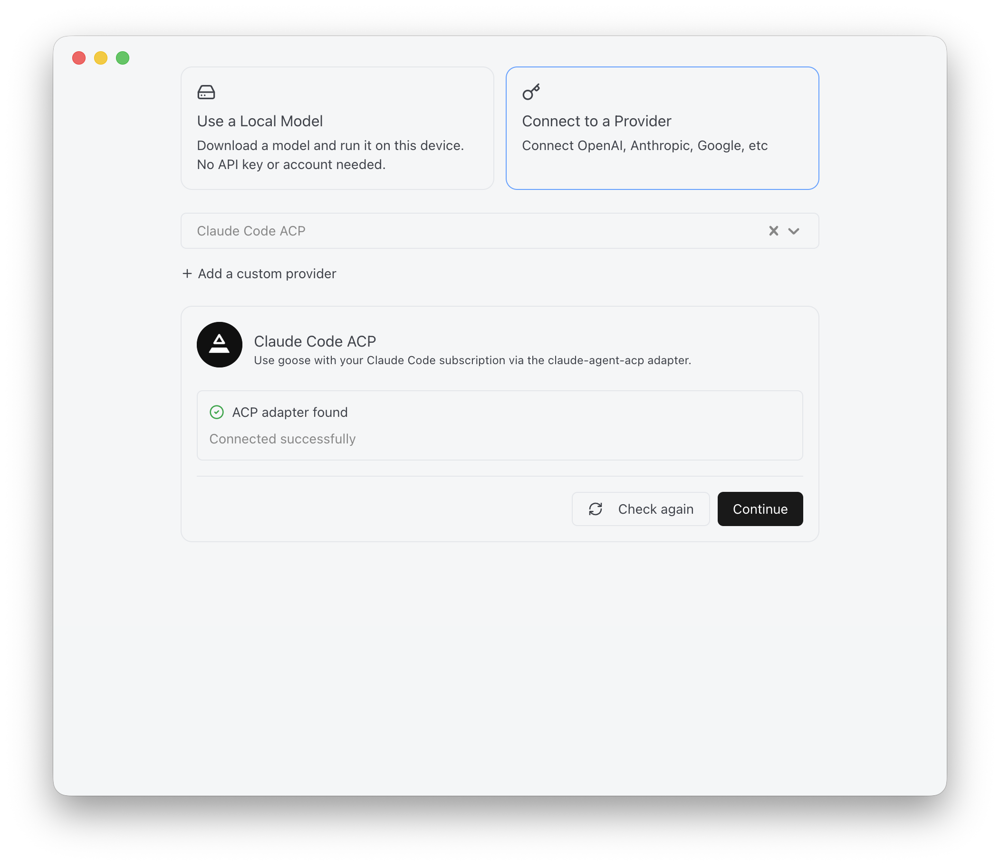

# goose — the agent runtime

[goose](https://goose-docs.ai/) runs the agent loop. Model is swappable and lives behind a provider config.

```
┌─────────────────────────────────────────────────┐
│ 🐳 Container                                    │
│ namespace isolation, but shared kernel          │
│                                                 │
│  ┌───────────────────────────────────────────┐  │
│  │ 🪿 goose                                  │  │
│  │ open-source agent runtime                 │  │
│  │                                           │  │
│  │  ┌─────────────────────────────────────┐  │  │
│  │  │ 🧠 LLM                              │  │  │
│  │  │ model-agnostic                      │  │  │
│  │  └─────────────────────────────────────┘  │  │
│  └───────────────────────────────────────────┘  │
└─────────────────────────────────────────────────┘
```

## Why goose?

- Model-agnostic. Swapping providers doesn't change the front-end.
- Prepackages plugins, skills, extensions per agent.
- Runs headless outside an IDE — the point of the whole setup.

> [!IMPORTANT]
> I chose goose because it's an [Agentic AI Foundation (AAIF)](https://aaif.io/projects/goose) project — foundation-governed with same reasoning as picking CNCF over proprietary tools: no vendor lock-in.

## ACP built in

`goose session`, `goose acp`, and `goosed` are the **same Agent core** with different interfaces:

| | Interface |
|---|---|
| `goose session` | interactive CLI prompt |
| `goose run --text` | one-shot, headless |
| `goose acp` | stdio JSON-RPC |
| `goosed` | REST + SSE |

One brain, swappable mouth. ACP is native — no `claude-agent-acp`-style wrapper needed.

**Consequence:** no sidecar. The ACP server *is* the goose binary 💃👌

## Local Development (Mac only)

The target architecture has remote agents. But local testing is important to nail down configuration, instructions, etc.

<details>
  <summary><strong>Install goose and connect Claude (macOS)</strong></summary>

### Authentication via Claude subscription

Alternative to API keys while prototyping. Uses my Claude Max subscription via ACP.

> [!WARNING]
> **Do not mount `~/.claude`.** Per Anthropic usage policy: authN via ACP, then `/login` _within_ the ACP session. Otherwise use an API token.

```
goose (client) → ACP → claude-agent-acp → Claude Code
```

`claude-agent-acp` is an adapter on the official Claude Agent SDK. A client wrapper, not a replacement — same reasoning [Zed](https://zed.dev/acp) uses for its chat panel.

### Setup

```sh
brew install --cask block-goose      
brew install block-goose-cli        
npm install -g @agentclientprotocol/claude-agent-acp
goose configure
```

- Select **"Claude Code ACP"** as provider. **Not** "Anthropic" — that's API-key based.
- Default model is fine.
- Claude Code CLI does the authenticating (normal `/login` OAuth). goose orchestrates around it, doesn't hold the subscription.
- MCP extensions configured in goose pass through to Claude — existing `.mcp.json` carries through.



### Known gap

**No `session resume` / `session fork` on ACP providers.** Native goose providers only.
</details>


## Linux (container)

What I'm calling `goose-in-a-box`.

```sh
apt-get install -y bzip2 curl ca-certificates
curl -fsSL https://github.com/aaif-goose/goose/releases/download/stable/download_cli.sh \
  | CONFIGURE=false bash
```

[Full instructions &rarr;](https://goose-docs.ai/docs/getting-started/installation)

### goose provider config

`~/.config/goose/config.yaml`. Bake it into the image — no `goose configure`, no interactive prompts.

```yaml
providers:
  vercel_ai_gateway:
    enabled: true
    model: openai/gpt-5-mini
    configured: true
active_provider: vercel_ai_gateway
GOOSE_TELEMETRY_ENABLED: false
GOOSE_THINKING_EFFORT: medium
```

- Provider slug is `vercel_ai_gateway` — not guessable, comes from the [declarative JSON](https://goose-docs.ai/docs/guides/providers/#vercel-ai-gateway).
- Model strings are `creator/model-name`.
- API key via env: `AI_GATEWAY_API_KEY`.
- `GOOSE_PROVIDER` / `GOOSE_MODEL` env vars override the file. ✅ Verified in-container 2026-08-30 — a bogus `GOOSE_PROVIDER` beat the baked `active_provider` and errored with "No model configured."

> [!Tip]
> See [identity.md](./identity.md) for auth and credential handling.

### Driving it from a controller

**Phase 1 uses `goose run --text "$PROMPT"`** — fire-and-die, one process, no client.

`goose acp` + an ACP client is the alternative when a controller needs streaming progress, permission prompts, or mid-task intervention. Proven working: [`spikes/goose-acp-spawn/`](../spikes/goose-acp-spawn/).

## Decision log

| Decision | Notes |
|---|---|
| Harness | goose. Model-agnostic, headless, prepackages skills, AAIF-governed. |
| Config | Baked into the image at `~/.config/goose/config.yaml`. No interactive setup. |
| Sidecar | None. ACP is native to the goose binary. |
| Phase 1 invocation | `goose run --text`. ACP available but not needed for fire-and-die. |
| AuthN (local dev) | Either API key, or Claude subscription via ACP. |
| AuthN (remote agent) | API tokens, vendor-agnostic. |

### Accepted Trade-Offs

| Tradeoff | Notes |
|---|---|
| No session resume/fork on ACP | Doesn't matter. ACP is local dev only; prod uses API tokens. |
| Vercel AI Gateway adds a hop | Testing convenience — credits, and easy provider swapping. Not a production dependency. |

## Misc.

### Alternatives

- [LangChain "Deep Agents"](https://docs.langchain.com/oss/javascript/deepagents/overview) — more of a harness library, requiring more plumbing.

## References

From official goose documentation

- [Configuration Overview](https://goose-docs.ai/docs/guides/config-files/)
- [Providers > Vercel AI Gateway Definition JSON](https://goose-docs.ai/docs/guides/providers/#vercel-ai-gateway), loaded via [openai_compatible.rs](https://github.com/aaif-goose/goose/blob/main/crates/goose-providers/src/openai_compatible.rs)
- [CI/CD](https://goose-docs.ai/docs/tutorials/cicd/) — feeding instructions, pushing to GitHub via `gh` CLI
- [Automate Development Tasks with goose Headless Mode](https://goose-docs.ai/docs/tutorials/headless-goose)
