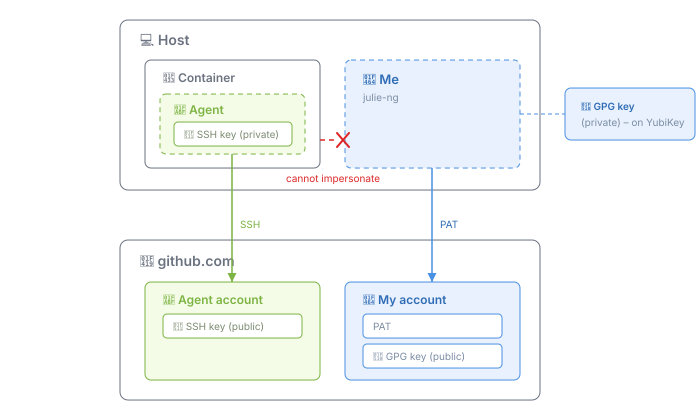

# Identity — me vs. the agent

The agent is not me. Own GitHub account. Own SSH key. Own credentials to everything in the SDLC.



Two things kept apart:

- **Authentication** — can it push?
- **Attribution** — whose name is on the commit?

## GitHub

Agent gets its own GitHub account and its own ED25519 key (`ssh-keygen -t ed25519 -N ""`).

One key, registered twice:

- as an **authentication key** → push access
- as a **signing key** → commits get the green "Verified" badge under the agent's name, not mine

Set at clone time — the pod is disposable, so there's nothing to inherit:

```sh
user.name / user.email     # agent identity
gpg.format ssh             # sign with the SSH key
user.signingkey            # agent's public key
core.sshCommand            # pinned to agent key + IdentitiesOnly=yes
```

> [!IMPORTANT]
> `IdentitiesOnly=yes` is load-bearing. Without it, SSH offers every key in the agent — including mine.

Net effect: every agent commit is cryptographically distinguishable from mine.

> [!NOTE]
> **Deploy keys** are the alternative for push access. Repo-scoped, blockable from `main`. Not chosen — they can't sign commits, and attribution is the point.

## Scope — GitHub, nothing else

The agent's only outbound write is **pushing to its own branch**.

- No deploy credentials. No cloud keys. No package-registry tokens.
- Downstream runs off **GitHub hooks** — CI, deploys, checks. Reacting to the branch, not driven by the agent.
- Inputs come from the orchestrator.

> [!IMPORTANT]
> Blast radius. A compromised or hallucinating agent can only produce a branch. Branches are reviewable and revertible.

## LLM auth

Depends on who's driving.

| | Human-driven (local dev) | Headless (remote agent) |
|---|---|---|
| **Mechanism** | ACP → Claude Code CLI | API key |
| **Binding** | My Claude subscription | Agent's own credential |
| **Model** | Claude only | Model-agnostic, e.g. `codex`, `qwen` |

ACP is a local-dev convenience — it borrows my subscription, so there's a human in the loop by definition. Headless agents get their own API key and no human account is involved.

> [!NOTE]
> The agent has its own GitHub identity in both cases. Only the *LLM* credential differs.

## Getting the key into the pod

SSH key as a K8s Secret, mounted into the init container that clones.

```yaml
volumes:
  - name: ssh-key
    secret:
      secretName: agent-ssh-key
      defaultMode: 0400        # ssh refuses group/world-readable keys
```

- One key does clone, push, and signing. No separate `GITHUB_TOKEN` — SSH covers all three.
- `defaultMode: 0400` is load-bearing. SSH rejects a key with looser permissions.
- Private key is in the pod, not on my machine. Different trade-off than agent forwarding: the key exists at rest inside the container, so it's scoped to one repo and rotatable rather than protected by never crossing a boundary.

> [!IMPORTANT]
> **Not yet built.** Nothing has pushed a branch from a container.

## Decision log

| Decision | Notes |
|---|---|
| GitHub identity | Own account, not just a deploy key. Deploy keys can't sign. |
| Key | One ED25519 — clone, push, and signing. No separate token. |
| Git config | Set at clone time. `IdentitiesOnly=yes`. |
| Write scope | Push to own branch. Downstream via hooks, inputs via orchestrator. |
| LLM auth (human-driven) | ACP on my Claude subscription. |
| LLM auth (headless) | API keys, vendor-agnostic. |
| Key delivery | K8s Secret mounted `0400` into the init container. |

### Accepted Trade-Offs

| Tradeoff | Notes |
|---|---|
| Agent borrows my LLM identity | Local dev only. GitHub identity is separate either way. |
| Private key at rest in the pod | Scoped to one repo and rotatable. Weaker than never crossing a boundary, but the pod is disposable. |
