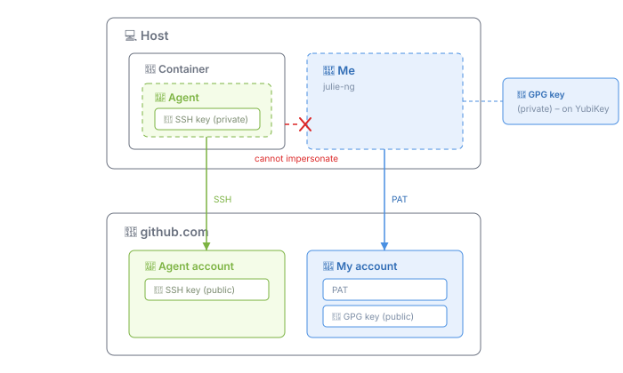

# Identity — me vs. the agent

The agent is not me. Own GitHub identity, own credentials to everything in the SDLC.



Two things kept apart:

- **Authentication** — can it push?
- **Attribution** — whose name is on the commit?

## Why this changed — the agent needs the API, not just git

**This is the origin of the whole shift.** The earlier model was "one ED25519 key does clone, push and signing — no `GITHUB_TOKEN` needed." That held only as long as the agent's work ended at a pushed branch.

It does not. Reading issues and opening PRs means the GitHub REST API, which `gh` fronts — and the API takes a token. SSH gets you git transport and nothing more.

Once a token is unavoidable, "no `GITHUB_TOKEN`, SSH covers all three" stops being achievable, and keeping an SSH key *as well* means two credentials for one identity. That forced the question of *which* token — and a long-lived PAT in a disposable pod is the worst of the options, which is what pointed at GitHub Apps and short-lived installation tokens.

## Two tiers, two mechanisms

The split mirrors the one already made for [LLM auth](#llm-auth): what runs on my machine with me present is not what runs unattended in the cloud.

| | **Local — interactive** | **Cloud — autonomous** |
|---|---|---|
| Where | Docker Sandbox / dev container on my machine | K8s pod, webhook-triggered |
| Human | present | none |
| Identity | dedicated bot account | GitHub App (`…[bot]`) |
| Credential | ED25519 keypair, long-lived | installation token, 1-hour expiry |
| Repo scope | deploy key, one repo | App install, selected repos |
| Signing | SSH signing key → "Verified" | auto-verified by GitHub |

**Neither replaces the other.** A standing SSH key suits a session where a filesystem and `ssh-agent` can hold it and I am there. It does not suit a disposable pod that exists for one task — there is no agent to hold the key open, and a long-lived credential at rest in a container is a worse trade than one that expires in an hour.

> [!IMPORTANT]
> **This supersedes the earlier "one ED25519 key, SSH covers all three" model, which assumed one mechanism for both tiers.** That was a change of mind, not a deviation discovered in implementation — see [Decision log](#decision-log).

## Current status

> [!IMPORTANT]
> **What is actually built, as of 2026-09-11.**
>
> | | State |
> |---|---|
> | Agent GitHub account (`julieio-goose`) | **exists**, push access to a test repo |
> | Container reads an issue, pushes a branch, opens a PR as the agent | **working** — verified in [`goose-k8s-prep`](../spikes/goose-k8s-prep/) |
> | Credential used to do it | **a classic PAT**, not SSH and not a GitHub App |
> | Commit signing | **not attempted** |
> | GitHub App | **not registered** |
> | Anything in K8s | **nothing** — all runs were plain `docker run` |
>
> The PAT is a **spike-phase shortcut**: faster to set up, and `gh` cannot authenticate over SSH at all. It is not the intended destination for either tier.

### What the PAT actually scopes

A classic PAT (`ghp_`) carries account-wide scopes — the one in use holds `repo`, `gist`, `project`, `user`. It does **not** scope to a repository.

> [!IMPORTANT]
> The write boundary today is **GitHub's repo permissions on the agent account** (`push: true`, `admin: false`), not the token. Do not describe the current credential as repo-scoped. Both target mechanisms below fix this — a deploy key by construction, a GitHub App by install scope.

## Where this is going — workload identity

The likely endpoint is to **drop long-lived credentials entirely** and move to workload identity: federated identities mapped to the agent, minted per run, no standing secret to rotate or leak. The GitHub App's installation token is a step in that direction — a credential that exists only as long as the task — but the full model is not designed yet.

**Unevaluated.** Recorded so the direction is not mistaken for something settled. Details get discovered in a later phase.

## Local tier — bot account + deploy key

For an interactive session on my machine, where I am present.

One ED25519 keypair (`ssh-keygen -t ed25519 -N ""`), registered in **two places for two different jobs**:

| Registered as | Where | Gives |
|---|---|---|
| **Signing key** | on the bot account | commits verified under the agent's name |
| **Deploy key**, write access | on the repo | push, one repo only |

```sh
git config --local user.name / user.email   # bot identity
git config --local gpg.format ssh
git config --local user.signingkey <pubkey>
git config --local commit.gpgsign true
git config --local core.sshCommand "ssh -i <key> -o IdentitiesOnly=yes"
```

> [!IMPORTANT]
> `IdentitiesOnly=yes` is load-bearing. Without it SSH offers every key it can find — including mine.

`--local` throughout: the config lives in the working copy, so it cannot leak into my other repos.

> [!NOTE]
> `-N ""` (no passphrase) is a deliberate choice for **unattended** invocation, not a default. For a key I trigger myself, a real passphrase in `ssh-agent` or the OS keychain is the better trade.

Branch protection on `main` still blocks the deploy key from pushing there, forcing feature branches.

## Cloud tier — GitHub App

For a pod with no human and no standing session.

The App **is** the identity — no second account to create or maintain. Commits and PRs appear as `julieio-agent[bot]`, auto-verified, with no SSH signing config at all.

**Three values the pod needs:** App ID, Installation ID (both plain config, not secrets) and the private key (Secret-level).

The flow, per run:

1. Sign a JWT with the App's private key — RS256, `iss` = App ID, `exp` ≤ 10 min
2. `POST /app/installations/<id>/access_tokens` → installation token (`ghs_…`), **1-hour expiry**
3. Use it as an HTTPS credential: `https://x-access-token:<token>@github.com/…`
4. Open the PR with the same token

Permissions granted at App level, repos chosen at install time:

| Permission | Why |
|---|---|
| Contents: read/write | push branches |
| Pull requests: read/write | open PRs |
| Metadata: read | required baseline |

Nothing else. Add `Checks` or `Issues` only when the agent is actually expected to report back.

> [!IMPORTANT]
> **The private key is the only long-lived secret, and it never needs to be in the task pod.** Mount it as a Secret *volume*, never an env var — env vars surface in `kubectl describe` and logs.
>
> Better still: mint the token **in the controller, before creating the Job**, and inject only the already-short-lived token. The private key then never enters the pod that runs untrusted model output.

> [!NOTE]
> GitHub issues the key in **PKCS#1**; some JWT libraries (Node's `jsonwebtoken`) want PKCS#8. Convert with `openssl pkcs8 -topk8 -nocrypt`. Verify a key matches GitHub's record by comparing `openssl rsa -pubout | sha256 | base64` against the fingerprint on the App's settings page.

> [!NOTE]
> Use Octokit (`@octokit/auth-app`) or PyGithub rather than hand-rolling JWT signing, unless debugging inside a container that lacks them.

### Open questions

- **Where does token minting live** — init container, or the controller before Job creation? The controller keeps the private key out of the task pod entirely, which is the stronger position and worth prototyping first.
- **Inbound webhook secret vs. outbound private key.** If the same App also receives triggering webhooks, those are two different secrets for two different directions. Do not conflate them.

## Scope — GitHub, nothing else

The agent's only outbound write is **pushing to its own branch**.

- No deploy credentials. No cloud keys. No package-registry tokens.
- Downstream runs off **GitHub hooks** — CI, deploys, checks. Reacting to the branch, not driven by the agent.
- Inputs come from the orchestrator.

> [!IMPORTANT]
> Blast radius. A compromised or hallucinating agent can only produce a branch. Branches are reviewable and revertible.
>
> **Caveat for the current state:** this holds under a deploy key or an App install. It does **not** hold under the classic PAT in use today, whose scopes are account-wide — see [What the PAT actually scopes](#what-the-pat-actually-scopes).

## LLM auth

Depends on who's driving. Same local/cloud split as GitHub identity, for the same reason.

| | Human-driven (local dev) | Headless (remote agent) |
|---|---|---|
| **Mechanism** | ACP → Claude Code CLI | API key |
| **Binding** | My Claude subscription | Agent's own credential |
| **Model** | Claude only | Model-agnostic, e.g. `codex`, `qwen` |

ACP is a local-dev convenience — it borrows my subscription, so there's a human in the loop by definition. Headless agents get their own API key and no human account is involved.

> [!NOTE]
> The agent has its own GitHub identity in both cases. Only the *LLM* credential differs.

## Decision log

| Date | Decision | Notes |
|---|---|---|
| — | GitHub identity separate from mine | Own account, not just a deploy key on my own. Attribution is the point. |
| — | Write scope | Push to own branch. Downstream via hooks, inputs via orchestrator. |
| — | LLM auth (human-driven) | ACP on my Claude subscription. |
| — | LLM auth (headless) | API keys, vendor-agnostic. |
| 2026-09-11 | **Split identity into local and cloud tiers** | **Triggered by `gh` requiring a token** — see [Why this changed](#why-this-changed--the-agent-needs-the-api-not-just-git). Once a token was unavoidable, one mechanism could not serve both. A standing SSH key fits a session I am present for; a disposable pod is better served by a credential that expires. Mirrors the split already made for LLM auth. |
| 2026-09-11 | **Cloud tier: GitHub App, not SSH** | Chosen once `gh` forced a token: if a credential is required anyway, a 1-hour installation token beats a standing PAT. The App *is* the identity — no second account, auto-verified attribution, no signing config. Installation tokens expire in 1 hour, matching a stateless per-task pod. Supersedes "one ED25519 key, SSH covers all three." |
| 2026-09-11 | Local tier: keep bot account + deploy key | Still the right fit where a human is present and something can hold a long-lived key. |
| 2026-09-11 | **PAT during the spike** | Faster to set up, and `gh` cannot auth over SSH. Deliberate shortcut, not the destination. |
| 2026-09-11 | Commit signing deferred | Not a Phase 1 blocker, and the App tier gets verification without a signing step. |
| 2026-09-11 | Workload identity is the likely endpoint | Direction only — **unevaluated**, details in a later phase. Recorded so it is not mistaken for a plan. |

### Accepted Trade-Offs

| Tradeoff | Notes |
|---|---|
| Agent borrows my LLM identity | Local dev only. GitHub identity is separate either way. |
| Local tier holds a long-lived key | Passphrase-less for unattended use. Scoped to one repo by the deploy key, rotatable. |
| Cloud tier keeps one long-lived secret | The App's private key. Mitigated by minting tokens outside the task pod, so the pod only ever holds a 1-hour token. |
| **Current PAT is account-scoped** | Accepted for the spike only. Real boundary is repo permissions, not the token. Both target mechanisms fix this. |
