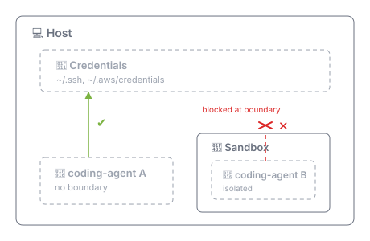

# Sandbox - isolate the agent

Without some level of hardware isolation… _technically_ your coding agent can access everything _you_ have access to:

 

What's stopping it? Not much, even though providers include protections against prompt injections. **Claude-Code already hallucinated `../../` once for me.**

After that incident, I setup [Dev Containers](https://containers.dev/) in my [Zed IDE](https://zed.dev/docs/editor/dev-containers).

### MicroVMs vs Sandboxes

 Now I want something for running autonmous agents _external_ to my IDE and managed by _me_, not my main claude session.

| | MicroVM | Dev Container |
|---|---|---|
| **Kernel Isolation** | Own kernel | Shared with host |
| **Hypervisor isolation** | Full | Partial |
| **Docker daemon** | Isolated | Shared with host |
| **Network** | Isolated — own stack inside the VM | Bridged — own namespace, routed via host |

### Docker Sandbox

I chose [Docker Sandbox](https://docs.docker.com/ai/sandboxes/) because I can leverage my existing experience without dealing with new abstraction layers.

Also the sandbox CLI is free to use, including for commercial work.

## Install

Via Homebrew

```sh
brew trust docker/tap
brew install docker/tap/sbx
```

Then login

```sh
sbx login
```

Follow [Getting Started](https://docs.docker.com/ai/sandboxes/get-started/) instructions, e.g.

```sh
sbx run --name my-sandbox claude
```

> [!IMPORTANT]
> When the sandbox starts, you will see claude-code CLI and need to run `/login` to authenticate against subscription.


### Authentication

- Claude: via `~/.claude/.credentials.json`
- Git: sandbox automatically looked for `GH_TOKEN`.

### Network Policies

<details>
<summary>How to Configure</summary>

"Balanced" config option:
- Default deny
- Common dev sites allowed.


```sh
sbx policy reset
sbx policy allow network <host>
sbx policy deny network <host>
sbx policy rm network <host>
```
</details>


# Misc.


### Alternatives

- [Sandvault](https://github.com/webcoyote/sandvault) – used by Homebrew maintainer [Mike McQuaid](https://mikemcquaid.com/sandboxed-agent-worktrees-my-coding-and-ai-setup-in-2026/), but its security model is managed vy user-privileges via separate user accounts on the mac. Not enough isolation.
- [Sprites](https://fly.io/sprites/) – hosted infra with usaged based pricing.
- [LimaVM](https://github.com/lima-vm/lima) – minimal VM setup for [Joy Heron's workflow](https://www.innoq.com/en/blog/2025/12/dev-sandbox/). I want to try containers first.
